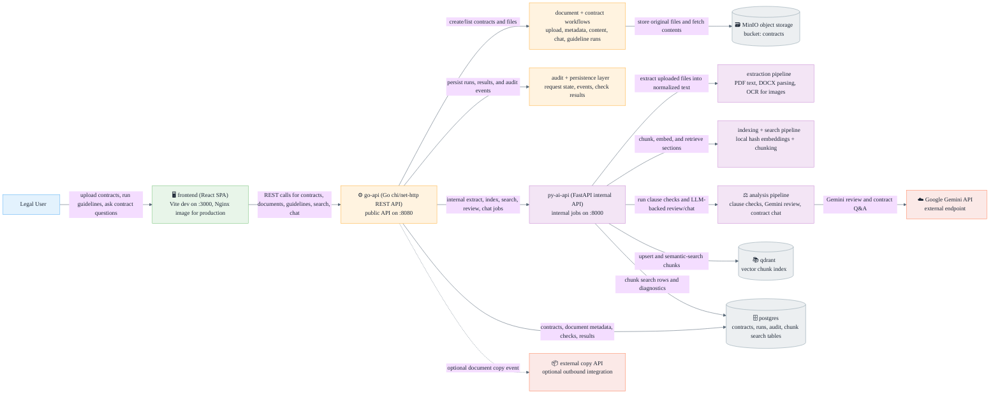
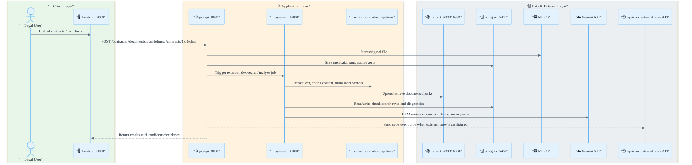
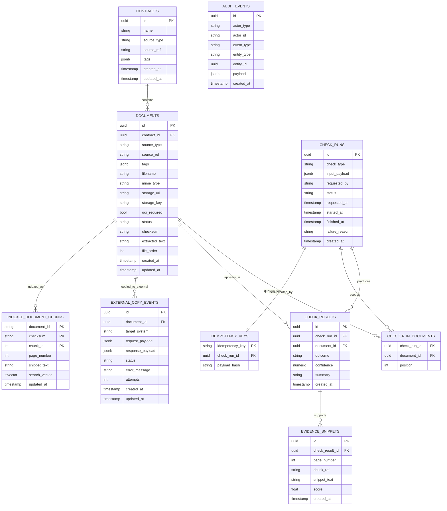

# IntelLegal - Legal Document Intelligence Platform

[](./README.md)
[](./frontend/package.json)
[](./go-api/go.mod)
[](./py-ai-api/pyproject.toml)
[](./README.md#-architecture)
[](./infra/terraform/README.md)
[](./README.md#-stack-decision)
[](https://codecov.io/gh/tot-ra/intellegal)


## 1. 🎯 Problem and Constraints

### Problem
Legal teams spend significant time on repetitive contract review tasks:
- Finding contracts that miss required clauses
- Reviewing contracts against legal guidance using both lexical and LLM-based checks
- Comparing contract versions for consistency

This process is currently semi-manual, slow, and hard to scale.

### Constraints
- Documents are typically stored in enterprise repositories (e.g., SharePoint), largely in PDF.
- Some contracts are legacy scans/images (JPEG), including low-quality handwritten content.
- A contract storage REST API exists and may be used only to store an additional legally compliant copy.
- Technology direction:
  - Best-of-breed evaluation is expected
  - Microsoft-native alternatives must be considered
- Project deliverables:
  - 15-20 minute solution presentation
  - Basic end-to-end implementation prototype

---


## 2. 🧩 Product Use Cases, User Stories, and Features

### 👥 Personas
- Legal Reviewer: validates contract compliance and wording updates.
- Legal Operations Lead: tracks review throughput, quality, and backlog.
- Platform Engineer: operates ingestion/indexing and integrations.

### 📌 Primary Use Cases
1. Missing Clause Detection
- Find all contracts that do not contain a required legal clause.

2. Guided Contract Review
- Run either a lexical clause check or a Gemini-powered review, depending on whether exact wording or legal interpretation matters more.

3. Contract Comparison and Evidence Review
- Review where a clause/entity appears, with page-level evidence snippets.
  Spec: [Contract Comparison](./docs/contract-comparison.md)

4. Contracts RAG Assistant
- Ask questions from the contracts list, let the assistant retrieve likely matches, expand the strongest contracts, and push result IDs back into the main list view.
  Spec: [Contracts RAG Assistant](./docs/contracts-rag-assistant.md)

5. Audit and Traceability
- Inspect who ran a check, when, and what evidence supported the result.

### 📝 User Stories (MVP)
1. As a Legal Reviewer, I upload/select contracts and run a "missing clause" check so I can prioritize remediation quickly.
2. As a Legal Reviewer, I choose between lexical clause checks, strict keyword checks, and Gemini reviews depending on the type of legal question.
3. As a Legal Reviewer, I open result details and see source snippet + page so I can trust and verify findings.
4. As a Legal Operations Lead, I view run history and status so I can report progress and bottlenecks.
5. As a Legal Reviewer, I ask cross-contract questions from the contracts list and apply returned result IDs back into the table so I can iteratively narrow the working set.
6. As a Platform Engineer, I inspect pipeline failures (OCR/indexing/API) so I can resolve issues fast.

### ✨ Features
- [Document Ingestion](./docs/document-ingestion.md)
- [OCR + Text Extraction](./docs/ocr-text-extraction.md)
- [Contract Comparison](./docs/contract-comparison.md)
- [Contracts RAG Assistant](./docs/contracts-rag-assistant.md)
- [Clause-Presence Checks](./docs/clause-presence-checks.md)
- Gemini contract review
- Strict keyword checks
- Contracts RAG assistant with interactive result sets
- Result confidence + evidence snippets
- Check run history
- External REST API copy storage + status
- Basic audit logging


### 🔭 Non-MVP (Phase 2)
- GraphRAG for relationship-heavy multi-hop legal reasoning
- Full production SharePoint sync and governance policies
- Multi-language legal interpretation enhancements

---

## 3. 🧭 UI Hierarchy (Information Architecture)

### 🧱 Top-Level Navigation
1. Dashboard
2. Contracts
3. Checks
4. Results
5. Audit Log
6. Settings

### 🗂️ Page Hierarchy
1. Dashboard
- KPI cards (contracts ingested, checks run, flagged contracts)
- Recent runs
- Failed pipeline jobs

2. Contracts
- Contract list/table
- Upload panel
- Filters (source, status, date)
- Contract detail drawer
- Ask AI assistant with expandable result blocks and apply-to-list actions

3. Checks
- New Guideline Run
  - Step 1: Select scope (all contracts / filtered set)
  - Step 2: Choose rule type (lexical clause / Gemini review / strict keyword)
  - Step 3: Input parameters
  - Step 4: Review and run

4. Results
- Run list
- Result table (contract, status, confidence)
- Detail panel with evidence snippets and page refs
- Export action (CSV, optional MVP)

5. Audit Log
- Searchable event timeline (ingestion, checks, API calls)

6. Settings
- API endpoints/config health
- Model/provider toggles (if needed for demo)

### 🧩 Key UI Components
- `ContractTable`
- `UploadDropzone`
- `CheckBuilderForm`
- `RunStatusBadge`
- `EvidenceSnippetCard`
- `ResultDetailPanel`
- `AuditEventTable`

---

## 4. 🏗️ Architecture

### 🔌 FE/BE Service Architecture


### 🔄 Runtime View (Request Flow)


### 🤔 Why This Architecture
- Keeps UI simple and task-focused for legal users.
- Moves extraction, indexing, search, and LLM-backed analysis into a dedicated internal service.
- Supports transparent evidence-based AI outputs.
- Maps cleanly to containerized deployment with optional external integrations.

---

## 🛠️ Local Development (Make)

Use the `Makefile` targets for local stack lifecycle and tests.

### 📦 Prerequisites
- Docker + Docker Compose
- GNU Make
- `python3` (for Python test target)
- `go` (for Go test target)
- `bun` or `npm` (for frontend test target)

### 1. ⚙️ Initialize local environment
```bash
make init
```

This creates `.env` from `.env.example` (if missing) and prepares local sample storage.

### 2. 🚀 Start the full stack
```bash
make up
```

Useful follow-up commands:
```bash
make ps
make logs
```

Default local endpoints:
- Frontend: `http://localhost:3000`
- Go API: `http://localhost:8080`
- Python AI API: `http://localhost:8000`
- PostgreSQL: `localhost:5432`
- Qdrant: `http://localhost:6333`
- Redis: `localhost:6379`
- MinIO API: `http://localhost:9000` (console: `http://localhost:9001`)

### 3. 🗄️ Run database migrations
```bash
make migrate-up
```

Optional helpers:
```bash
make migrate-version
make migrate-down
```

### 4. ✅ Run tests
We use a practical test pyramid across the stack so day-to-day development stays fast while still keeping full user journeys covered:

- Base layer: fast unit tests in Go, Python, and the frontend.
- Middle layer: integration tests for backend/API behavior.
- Top layer: Playwright end-to-end tests for critical browser workflows such as contract upload and navigation.

Recommended developer workflow:
- Run narrow, fast tests while implementing a change.
- Run the relevant language suite before opening a PR.
- Run Playwright for user-facing flows, routing changes, or upload/search/check experiences.

Run all suites:
```bash
make test
```

Run individual suites:
```bash
make test-go
make test-py
make test-fe
make test-fe-e2e
make test-fe-e2e-headed
```

What each target covers:

- `make test`
  Runs the main fast suites across Go, Python, and frontend unit/component tests.
- `make test-go`
  Runs Go unit and integration tests and prints combined coverage.
- `make test-go-unit`
  Runs the fastest Go feedback loop for handler, model, and utility changes.
- `make test-go-integration`
  Runs Go integration-tagged tests.
- `make test-py`
  Runs Python AI API unit and integration tests with combined coverage.
- `make test-py-unit`
  Runs Python unit tests for extraction, indexing, search, auth, and analysis logic.
- `make test-py-integration`
  Runs Python integration tests.
- `make test-fe`
  Runs frontend Vitest tests for components, routing, and client logic.
- `make test-fe-e2e`
  Runs Playwright browser tests in headless Chromium.
- `make test-fe-e2e-headed`
  Runs the same Playwright tests in visible Chromium for debugging local flows.

Typical examples:
```bash
# frontend UI change
make test-fe

# upload flow or routing change
make test-fe-e2e

# debug the browser flow visually
make test-fe-e2e-headed

# backend API change
make test-go

# AI pipeline change
make test-py
```

Notes:
- `make test` is intended to stay relatively fast and currently does not include Playwright.
- Playwright tests automatically install Chromium if needed through the frontend test target.

### 5. 🧹 Stop or clean stack
```bash
make down    # stop containers
make clean   # stop and remove volumes
```

---

## 📚 API Reference (Quick)

Legend: 🟢 `GET` | 🔵 `POST` | 🟣 `PUT` | 🟠 `PATCH` | 🔴 `DELETE`

Full contracts:
- Public API OpenAPI: [`docs/contracts/public-api.openapi.yaml`](./docs/contracts/public-api.openapi.yaml)
- Internal AI API OpenAPI: [`docs/contracts/internal-api.openapi.yaml`](./docs/contracts/internal-api.openapi.yaml)

<details>
<summary><strong>Go Main API (Public) - <code>http://localhost:8080</code></strong></summary>

Authentication:
- Public API follows the contract in `docs/contracts/public-api.openapi.yaml` (bearer auth scheme).

Endpoints:
- 🟢 `GET /api/v1/health` - Liveness check.
- 🟢 `GET /api/v1/readiness` - Readiness/dependency check.
- 🔵 `POST /api/v1/documents` - Create document ingest job.
- 🟢 `GET /api/v1/documents` - List documents (supports filters/pagination).
- 🟢 `GET /api/v1/documents/{document_id}` - Get one document.
- 🔵 `POST /api/v1/guidelines/clause-presence` - Start lexical clause-presence guideline.
- 🔵 `POST /api/v1/guidelines/llm-review` - Start Gemini-backed guideline review.
- 🟢 `GET /api/v1/guidelines/{check_id}` - Get guideline run status.
- 🟢 `GET /api/v1/guidelines/{check_id}/results` - Get guideline results with evidence.

</details>

<details>
<summary><strong>Python AI API (Internal) - <code>http://localhost:8000</code></strong></summary>

Authentication:
- Internal endpoints (except health) require internal service auth token (`INTERNAL_SERVICE_TOKEN`).

Endpoints:
- 🟢 `GET /internal/v1/health` - Service and config health.
- 🟢 `GET /internal/v1/bootstrap/auth-check` - Validate internal auth wiring.
- 🔵 `POST /internal/v1/extract` - Extract text/OCR from source.
- 🔵 `POST /internal/v1/index` - Chunk/embed/index into Qdrant.
- 🔵 `POST /internal/v1/analyze/clause` - Analyze required clause presence.
- 🔵 `POST /internal/v1/analyze/llm-review` - Run Gemini-backed contract review.

</details>

## 5. ⚖️ Stack Decision

### ✅ MVP Stack
- Frontend: React, TypeScript
- Main API: Go
- AI Pipeline API: Python, FastAPI, Pydantic
- AI Orchestration: LangChain/LangGraph (minimal use for MVP orchestration)
- OCR/Text: PDF parser + OCR engine
- Vector Search: Qdrant
- Deployment: Docker Compose (local), Azure-ready containers
- IaC: Terraform


---

## 6. 🔁 End-to-End Flow

1. User uploads/contracts are loaded for analysis.
2. Go API stores original files and records metadata.
3. Extraction pipeline parses PDF text and runs OCR for image-based inputs.
4. Text is normalized, chunked, embedded, and indexed in Qdrant.
5. Legal user submits a check or asks a contracts-list question:
- "Find contracts missing clause X"
- "Run a Gemini review for termination for convenience"
- "Which contracts mention late fees and can you narrow the list?"
6. Retrieval fetches relevant chunks with metadata filters and, for contracts-list chat, expands the strongest matching contracts before answering.
7. Python AI pipeline evaluates results and produces:
- matched/not-matched status
- confidence
- evidence snippets (with page/chunk references)
8. Frontend displays findings, detailed rationale, and assistant result sets that can be applied back into the contracts list.
9. Go API calls external REST API to store additional compliant copy.
10. Audit log records request, model/version, and result summary.

---

## 7. 🗃️ DB Storage

### 🧱 Storage Components
1. PostgreSQL (system of record)
- Contracts metadata
- Processing status
- Check requests and results
- Evidence links
- Audit events

2. Qdrant (retrieval index)
- Embeddings for text chunks
- Payload metadata (doc_id, page, section, source)

3. Blob/File Storage (object layer)
- Original uploaded files
- Optional extracted text artifacts (for debugging)

### 🧬 Relational Schema (MVP)



- `contracts`
  - `id (uuid, pk)`
  - `name`
  - `source_type`
  - `source_ref`
  - `tags (jsonb)`
  - `created_at`, `updated_at`

- `documents`
  - `id (uuid, pk)`
  - `contract_id (fk, nullable)`
  - `source_type` (sharepoint_upload/manual)
  - `source_ref`
  - `tags (jsonb)`
  - `filename`
  - `mime_type`
  - `storage_uri`
  - `storage_key`
  - `ocr_required (bool)`
  - `status` (ingested/processing/indexed/failed)
  - `checksum`
  - `extracted_text`
  - `file_order`
  - `created_at`, `updated_at`

- `check_runs`
  - `id (uuid, pk)`
  - `check_type` (clause_presence/llm_review)
  - `input_payload (jsonb)`
  - `requested_by`
  - `status` (queued/running/completed/failed)
  - `requested_at`, `started_at`, `finished_at`
  - `failure_reason`
  - `created_at`

- `check_run_documents`
  - `check_run_id (fk)`
  - `document_id (fk)`
  - `position`

- `check_results`
  - `id (uuid, pk)`
  - `check_run_id (fk)`
  - `document_id (fk)`
  - `outcome` (match/missing/review)
  - `confidence` (numeric)
  - `summary`
  - `created_at`

- `evidence_snippets`
  - `id (uuid, pk)`
  - `check_result_id (fk)`
  - `page_number`
  - `chunk_ref`
  - `snippet_text`
  - `score`
  - `created_at`

- `audit_events`
  - `id (uuid, pk)`
  - `actor_type`
  - `actor_id`
  - `event_type`
  - `entity_type`
  - `entity_id`
  - `payload (jsonb)`
  - `created_at`

- `external_copy_events`
  - `id (uuid, pk)`
  - `document_id (fk)`
  - `target_system`
  - `request_payload (jsonb)`
  - `response_payload (jsonb, nullable)`
  - `status` (queued/succeeded/failed)
  - `error_message`
  - `attempts`
  - `created_at`, `updated_at`

- `indexed_document_chunks`
  - `document_id`, `checksum`, `chunk_id` (composite pk)
  - `page_number`
  - `snippet_text`
  - `search_vector` (generated tsvector)
  - `updated_at`

- `idempotency_keys`
  - `idempotency_key (pk)`
  - `check_run_id (fk)`
  - `payload_hash`

### ♻️ Data Lifecycle
- Raw file retained in blob storage.
- Extracted chunks indexed in Qdrant; source of truth remains PostgreSQL + blob.
- Re-indexing is supported using `documents.checksum` and idempotent upsert.
- Audit events retained for legal traceability.

---

## 8. 🔐 Security and Compliance Baseline

- Secret management via env/secret manager; no hardcoded credentials
- Access control baseline (legal-user role model)
- Logging/auditability with document references and timestamps
- Sensitive data minimization in logs
- Immutable link/reference to original source document
- Explicit "AI-assisted" labeling of findings (human-in-the-loop review)

---

## 9. 📈 Adoption

### 🚚 Rollout Approach
1. Pilot with one clause family and one legal team subset.
2. Measure precision/recall and manual time saved.
3. Expand to additional templates and entity checks.

### 🎓 Enablement
- 30-minute onboarding and quick reference guide
- Evidence-first UX to improve trust
- Feedback loop for incorrect/uncertain outputs

### 📊 Value Metrics
- Review time per contract batch
- Percentage of checks automated
- False positive/false negative rate trend
- Weekly active users in legal team

---

## 10. ⚠️ Risks and Mitigations

1. OCR quality on poor scans
- Mitigation: preprocessing, confidence thresholds, manual review fallback

2. Weak or incorrect AI conclusions
- Mitigation: retrieval-grounded prompts, evidence-required outputs, deterministic fallback rules

3. Legal trust and explainability concerns
- Mitigation: snippet-level evidence, transparent scoring, human approval gate

4. Integration complexity with enterprise systems
- Mitigation: API abstraction, phased integration, containerized deployment

5. Scope creep during MVP
- Mitigation: strict MVP boundaries and prioritized backlog

---

## 11. License

This project is licensed under the GNU Affero General Public License, version 3 or later (`AGPL-3.0-or-later`).

- Open source use: available under AGPL terms (see [LICENSE](./LICENSE)).
- Commercial/enterprise use: available under a separate paid license for **100 EUR/month per company** (see [COMMERCIAL_LICENSE.md](./COMMERCIAL_LICENSE.md)).

If you need a commercial license, contact the repository maintainer.
