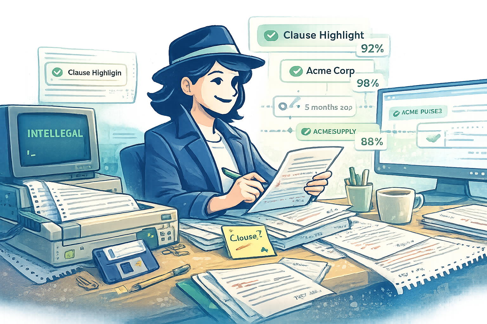
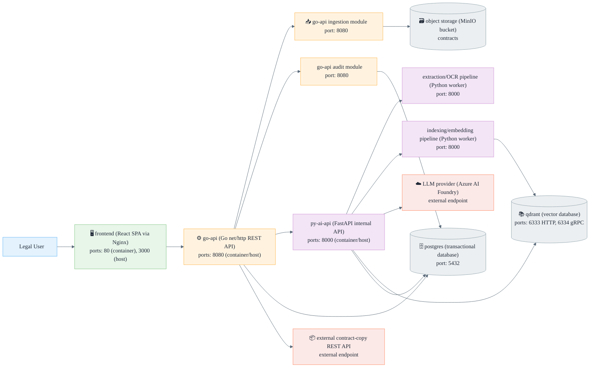
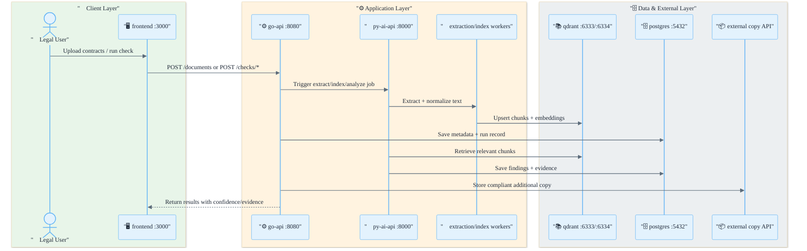
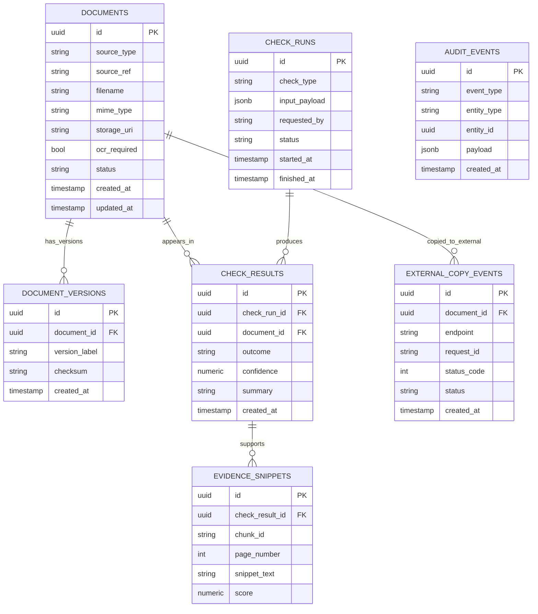

# IntelLegal - Legal Document Intelligence Platform

[](https://codecov.io/gh/tot-ra/intellegal)


## 1. 🎯 Problem and Constraints

### Problem
Legal teams spend significant time on repetitive contract review tasks:
- Finding contracts that miss required clauses
- Identifying contracts with outdated company names
- Comparing contract versions for consistency

This process is currently semi-manual, slow, and hard to scale.

### Constraints
- Documents are typically stored in enterprise repositories (e.g., SharePoint), largely in PDF.
- Some contracts are legacy scans/images (JPEG), including low-quality handwritten content.
- A contract storage REST API exists and may be used only to store an additional legally compliant copy.
- Technology direction:
  - Best-of-breed evaluation is expected
  - Microsoft-native alternatives must be considered
- Project deliverables:
  - 15-20 minute solution presentation
  - Basic end-to-end implementation prototype

---


## 2. 🧩 Product Use Cases, User Stories, and Features

### 👥 Personas
- Legal Reviewer: validates contract compliance and wording updates.
- Legal Operations Lead: tracks review throughput, quality, and backlog.
- Platform Engineer: operates ingestion/indexing and integrations.

### 📌 Primary Use Cases
1. Missing Clause Detection
- Find all contracts that do not contain a required legal clause.

2. Company Name Update Detection
- Find contracts containing an old legal entity name that should be replaced.

3. Contract Comparison and Evidence Review
- Review where a clause/entity appears, with page-level evidence snippets.

4. Audit and Traceability
- Inspect who ran a check, when, and what evidence supported the result.

### 📝 User Stories (MVP)
1. As a Legal Reviewer, I upload/select contracts and run a "missing clause" check so I can prioritize remediation quickly.
2. As a Legal Reviewer, I run an "old company name" check so I can produce an actionable list for updates.
3. As a Legal Reviewer, I open result details and see source snippet + page so I can trust and verify findings.
4. As a Legal Operations Lead, I view run history and status so I can report progress and bottlenecks.
5. As a Platform Engineer, I inspect pipeline failures (OCR/indexing/API) so I can resolve issues fast.

### ✨ Feature List (MVP)
- Document ingest (PDF/JPEG)
- OCR + text extraction pipeline
- Clause-presence checks
- Company-name checks
- Result confidence + evidence snippets
- Check run history
- External REST API copy storage + status
- Basic audit logging

### 🔭 Non-MVP (Phase 2)
- GraphRAG for relationship-heavy multi-hop legal reasoning
- Full production SharePoint sync and governance policies
- Multi-language legal interpretation enhancements

---

## 3. 🧭 UI Hierarchy (Information Architecture)

### 🧱 Top-Level Navigation
1. Dashboard
2. Contracts
3. Checks
4. Results
5. Audit Log
6. Settings

### 🗂️ Page Hierarchy
1. Dashboard
- KPI cards (contracts ingested, checks run, flagged contracts)
- Recent runs
- Failed pipeline jobs

2. Contracts
- Contract list/table
- Upload panel
- Filters (source, status, date)
- Contract detail drawer

3. Checks
- New Guideline Run
  - Step 1: Select scope (all contracts / filtered set)
  - Step 2: Choose check type (missing clause / company name)
  - Step 3: Input parameters
  - Step 4: Review and run

4. Results
- Run list
- Result table (contract, status, confidence)
- Detail panel with evidence snippets and page refs
- Export action (CSV, optional MVP)

5. Audit Log
- Searchable event timeline (ingestion, checks, API calls)

6. Settings
- API endpoints/config health
- Model/provider toggles (if needed for demo)

### 🧩 Key UI Components
- `ContractTable`
- `UploadDropzone`
- `CheckBuilderForm`
- `RunStatusBadge`
- `EvidenceSnippetCard`
- `ResultDetailPanel`
- `AuditEventTable`

---

## 4. 🏗️ Architecture

### 🔌 FE/BE Service Architecture


### 🔄 Runtime View (Request Flow)


### 🤔 Why This Architecture
- Keeps UI simple and task-focused for legal users.
- Moves heavy OCR/RAG workloads into a dedicated internal service.
- Supports transparent evidence-based AI outputs.
- Maps cleanly to containerized deployment and Azure hosting.

---

## 🛠️ Local Development (Make)

Use the `Makefile` targets for local stack lifecycle and tests.

### 📦 Prerequisites
- Docker + Docker Compose
- GNU Make
- `python3` (for Python test target)
- `go` (for Go test target)
- `bun` or `npm` (for frontend test target)

### 1. ⚙️ Initialize local environment
```bash
make init
```

This creates `.env` from `.env.example` (if missing) and prepares local sample storage.

### 2. 🚀 Start the full stack
```bash
make up
```

Useful follow-up commands:
```bash
make ps
make logs
```

Default local endpoints:
- Frontend: `http://localhost:3000`
- Go API: `http://localhost:8080`
- Python AI API: `http://localhost:8000`
- PostgreSQL: `localhost:5432`
- Qdrant: `http://localhost:6333`
- Redis: `localhost:6379`
- MinIO API: `http://localhost:9000` (console: `http://localhost:9001`)

### 3. 🗄️ Run database migrations
```bash
make migrate-up
```

Optional helpers:
```bash
make migrate-version
make migrate-down
```

### 4. ✅ Run tests
Run all suites:
```bash
make test
```

Run individual suites:
```bash
make test-go
make test-py
make test-fe
```

### 5. 🧹 Stop or clean stack
```bash
make down    # stop containers
make clean   # stop and remove volumes
```

---

## 📚 API Reference (Quick)

Legend: 🟢 `GET` | 🔵 `POST` | 🟣 `PUT` | 🟠 `PATCH` | 🔴 `DELETE`

Full contracts:
- Public API OpenAPI: [`docs/contracts/public-api.openapi.yaml`](./docs/contracts/public-api.openapi.yaml)
- Internal AI API OpenAPI: [`docs/contracts/internal-api.openapi.yaml`](./docs/contracts/internal-api.openapi.yaml)

<details>
<summary><strong>Go Main API (Public) - <code>http://localhost:8080</code></strong></summary>

Authentication:
- Public API follows the contract in `docs/contracts/public-api.openapi.yaml` (bearer auth scheme).

Endpoints:
- 🟢 `GET /api/v1/health` - Liveness check.
- 🟢 `GET /api/v1/readiness` - Readiness/dependency check.
- 🔵 `POST /api/v1/documents` - Create document ingest job.
- 🟢 `GET /api/v1/documents` - List documents (supports filters/pagination).
- 🟢 `GET /api/v1/documents/{document_id}` - Get one document.
- 🔵 `POST /api/v1/guidelines/clause-presence` - Start missing-clause guideline.
- 🔵 `POST /api/v1/guidelines/company-name` - Start company-name guideline.
- 🟢 `GET /api/v1/guidelines/{check_id}` - Get guideline run status.
- 🟢 `GET /api/v1/guidelines/{check_id}/results` - Get guideline results with evidence.

</details>

<details>
<summary><strong>Python AI API (Internal) - <code>http://localhost:8000</code></strong></summary>

Authentication:
- Internal endpoints (except health) require internal service auth token (`INTERNAL_SERVICE_TOKEN`).

Endpoints:
- 🟢 `GET /internal/v1/health` - Service and config health.
- 🟢 `GET /internal/v1/bootstrap/auth-check` - Validate internal auth wiring.
- 🔵 `POST /internal/v1/extract` - Extract text/OCR from source.
- 🔵 `POST /internal/v1/index` - Chunk/embed/index into Qdrant.
- 🔵 `POST /internal/v1/analyze/clause` - Analyze required clause presence.
- 🔵 `POST /internal/v1/analyze/company-name` - Analyze old/new company name usage.

</details>

## 5. ⚖️ Stack Decision

### ✅ MVP Stack
- Frontend: React, TypeScript
- Main API: Go
- AI Pipeline API: Python, FastAPI, Pydantic
- AI Orchestration: LangChain/LangGraph (minimal use for MVP orchestration)
- OCR/Text: PDF parser + OCR engine
- Vector Search: Qdrant
- Deployment: Docker Compose (local), Azure-ready containers
- IaC: Terraform


---

## 6. 🔁 End-to-End Flow

1. User uploads/contracts are loaded for analysis.
2. Go API stores original files and records metadata.
3. Extraction pipeline parses PDF text and runs OCR for image-based inputs.
4. Text is normalized, chunked, embedded, and indexed in Qdrant.
5. Legal user submits a check:
- "Find contracts missing clause X"
- "Find contracts containing old company name Y"
6. Retrieval fetches relevant chunks with metadata filters.
7. Python AI pipeline evaluates results and produces:
- matched/not-matched status
- confidence
- evidence snippets (with page/chunk references)
8. Frontend displays findings and detailed rationale.
9. Go API calls external REST API to store additional compliant copy.
10. Audit log records request, model/version, and result summary.

---

## 7. 🗃️ DB Storage

### 🧱 Storage Components
1. PostgreSQL (system of record)
- Contracts metadata
- Processing status
- Check requests and results
- Evidence links
- Audit events

2. Qdrant (retrieval index)
- Embeddings for text chunks
- Payload metadata (doc_id, page, section, source)

3. Blob/File Storage (object layer)
- Original uploaded files
- Optional extracted text artifacts (for debugging)

### 🧬 Relational Schema (MVP)



- `documents`
  - `id (uuid, pk)`
  - `source_type` (sharepoint_upload/manual)
  - `source_ref`
  - `filename`
  - `mime_type`
  - `storage_uri`
  - `ocr_required (bool)`
  - `status` (ingested/processing/indexed/failed)
  - `created_at`, `updated_at`

- `document_versions`
  - `id (uuid, pk)`
  - `document_id (fk)`
  - `version_label`
  - `checksum`
  - `created_at`

- `check_runs`
  - `id (uuid, pk)`
  - `check_type` (missing_clause/company_name)
  - `input_payload (jsonb)`
  - `requested_by`
  - `status` (queued/running/completed/failed)
  - `started_at`, `finished_at`

- `check_results`
  - `id (uuid, pk)`
  - `check_run_id (fk)`
  - `document_id (fk)`
  - `outcome` (match/missing/review)
  - `confidence` (numeric)
  - `summary`
  - `created_at`

- `evidence_snippets`
  - `id (uuid, pk)`
  - `check_result_id (fk)`
  - `chunk_id`
  - `page_number`
  - `snippet_text`
  - `score`

- `audit_events`
  - `id (uuid, pk)`
  - `event_type`
  - `entity_type`
  - `entity_id`
  - `payload (jsonb)`
  - `created_at`

- `external_copy_events`
  - `id (uuid, pk)`
  - `document_id (fk)`
  - `endpoint`
  - `request_id`
  - `status_code`
  - `status` (success/failed)
  - `created_at`

### ♻️ Data Lifecycle
- Raw file retained in blob storage.
- Extracted chunks indexed in Qdrant; source of truth remains PostgreSQL + blob.
- Re-indexing is supported using `document_versions.checksum` and idempotent upsert.
- Audit events retained for legal traceability.

---

## 8. 🔐 Security and Compliance Baseline

- Secret management via env/secret manager; no hardcoded credentials
- Access control baseline (legal-user role model)
- Logging/auditability with document references and timestamps
- Sensitive data minimization in logs
- Immutable link/reference to original source document
- Explicit "AI-assisted" labeling of findings (human-in-the-loop review)

---

## 9. 📈 Adoption

### 🚚 Rollout Approach
1. Pilot with one clause family and one legal team subset.
2. Measure precision/recall and manual time saved.
3. Expand to additional templates and entity checks.

### 🎓 Enablement
- 30-minute onboarding and quick reference guide
- Evidence-first UX to improve trust
- Feedback loop for incorrect/uncertain outputs

### 📊 Value Metrics
- Review time per contract batch
- Percentage of checks automated
- False positive/false negative rate trend
- Weekly active users in legal team

---

## 10. ⚠️ Risks and Mitigations

1. OCR quality on poor scans
- Mitigation: preprocessing, confidence thresholds, manual review fallback

2. Weak or incorrect AI conclusions
- Mitigation: retrieval-grounded prompts, evidence-required outputs, deterministic fallback rules

3. Legal trust and explainability concerns
- Mitigation: snippet-level evidence, transparent scoring, human approval gate

4. Integration complexity with enterprise systems
- Mitigation: API abstraction, phased integration, containerized deployment

5. Scope creep during MVP
- Mitigation: strict MVP boundaries and prioritized backlog

---

## 11. License

This project is licensed under the GNU Affero General Public License, version 3 or later (`AGPL-3.0-or-later`).

- Open source use: available under AGPL terms (see [LICENSE](./LICENSE)).
- Commercial/enterprise use: available under a separate paid license for **100 EUR/month per company** (see [COMMERCIAL_LICENSE.md](./COMMERCIAL_LICENSE.md)).

If you need a commercial license, contact the repository maintainer.
