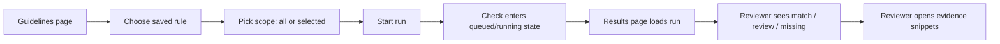
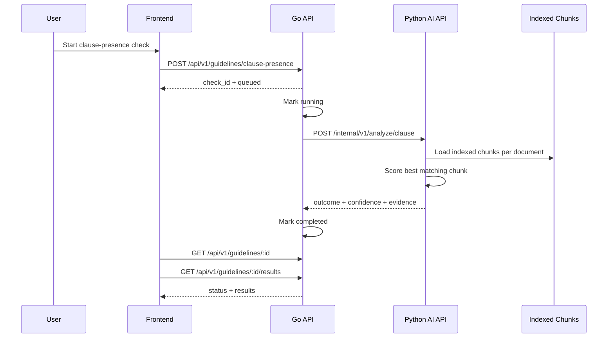
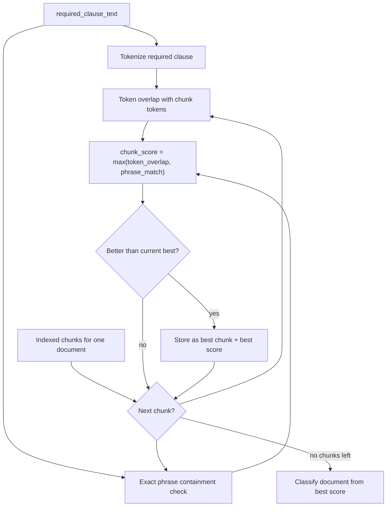
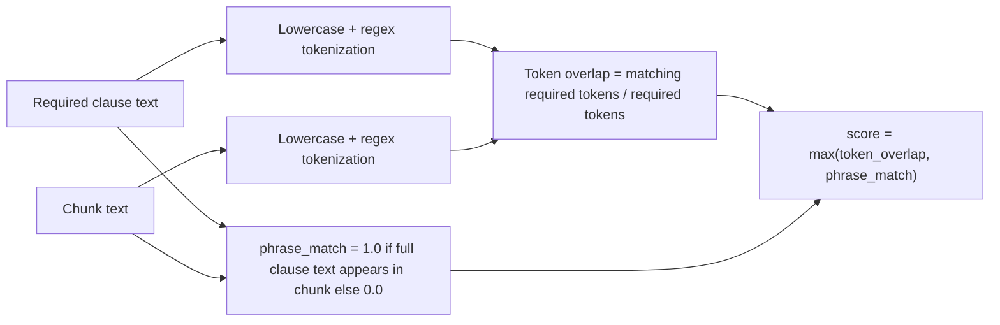
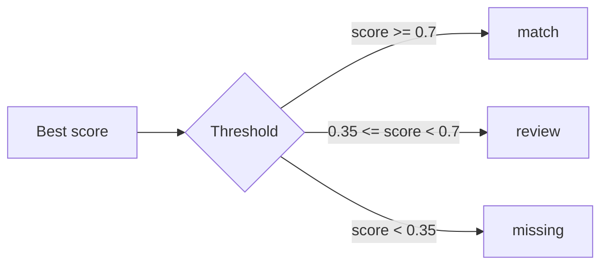
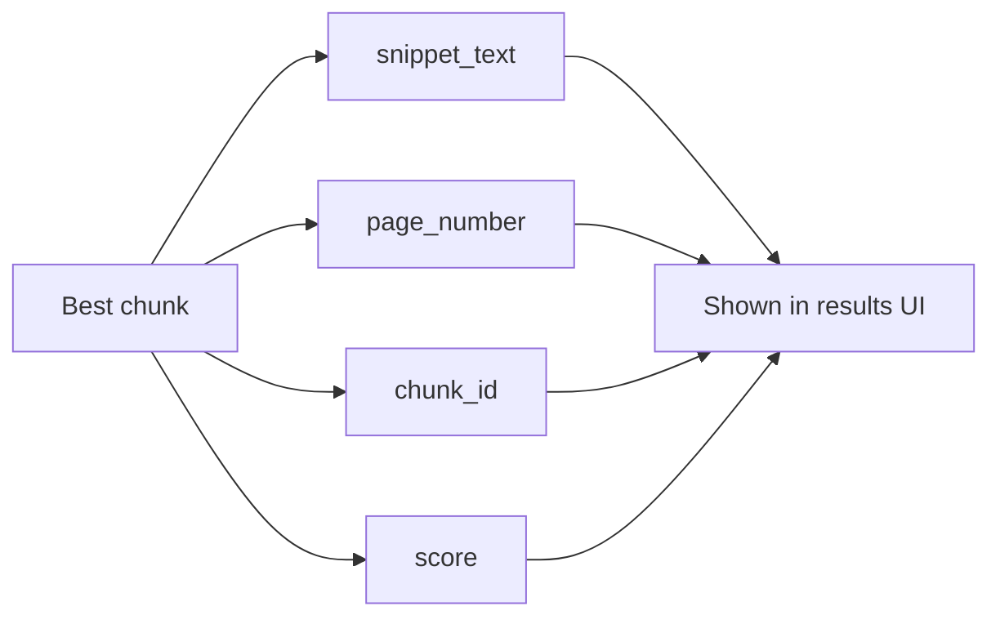
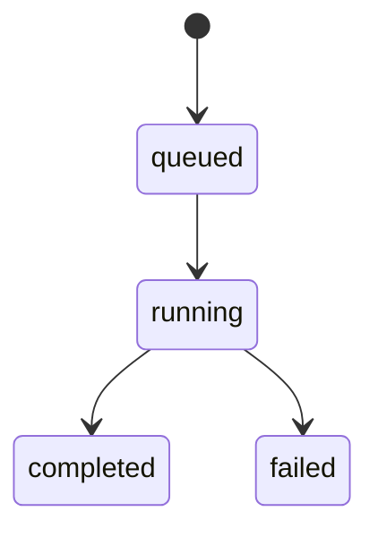
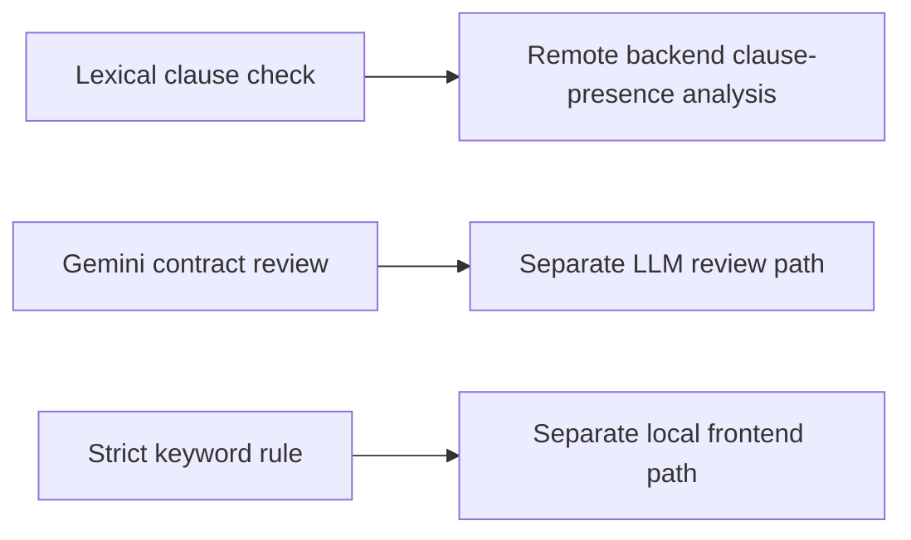

# Clause-Presence Checks

## User flow

### Current scope
- Run against all documents or a selected set
- Return one result per document
- Show summary, confidence, and evidence snippets

## Frontend rule mapping

- `Lexical clause check`: frontend rule type `clause_presence`; runs the backend clause-presence analysis described in this doc
- `Gemini contract review`: frontend rule type `gemini_review`; uses the separate LLM review path and is not covered by this doc
- `Strict keyword check`: frontend rule type `keyword_match`; runs locally in the frontend and is not covered by this doc

## Technical flow

### Main files
- [`frontend/src/pages/GuidelineRunPage.tsx`](../frontend/src/pages/GuidelineRunPage.tsx)
- [`frontend/src/pages/GuidelinesPage.tsx`](../frontend/src/pages/GuidelinesPage.tsx)
- [`frontend/src/api/client.ts`](../frontend/src/api/client.ts)
- [`go-api/internal/http/handlers/checks.go`](../go-api/internal/http/handlers/checks.go)
- [`py-ai-api/py_ai_api/services/analysis.py`](../py-ai-api/py_ai_api/services/analysis.py)
- [`py-ai-api/py_ai_api/api/routes/internal.py`](../py-ai-api/py_ai_api/api/routes/internal.py)

## How matching works

The lexical clause check does not build a graph of entities or clauses. Instead, it runs a simple document-by-document scoring pass over indexed text chunks:

1. Take the user-provided `required_clause_text`
2. Normalize and tokenize that text
3. Load indexed chunks for one document
4. Score each chunk with lexical heuristics
5. Keep only the best-scoring chunk for that document
6. Convert that best score into `match`, `review`, or `missing`

This flow is cyclic: the scorer loops over all chunks in the current document and keeps the best candidate seen so far. Mermaid supports cycles in `flowchart` diagrams, so using a loop here is valid and closer to the actual implementation.

## Where the lexical check is implemented

- Python entrypoint: `POST /internal/v1/analyze/clause`
- Route handler: [`py-ai-api/py_ai_api/api/routes/internal.py`](../py-ai-api/py_ai_api/api/routes/internal.py)
- Core logic: [`py-ai-api/py_ai_api/services/analysis.py`](../py-ai-api/py_ai_api/services/analysis.py)
- Triggered from Go API: [`go-api/internal/http/handlers/checks.go`](../go-api/internal/http/handlers/checks.go)

The Go API accepts the clause-presence request and forwards it to the Python AI service. The Python `AnalysisPipeline.analyze_clause(...)` method performs the actual lexical matching.

## Lexical scoring details

### What the code does

- `_tokenize(...)` extracts lowercase alphanumeric tokens using the regex `[a-z0-9]+`
- `_token_overlap(left, right)` computes:
  `len(required_tokens ∩ chunk_tokens) / len(required_tokens)`
- Phrase match is binary:
  `1.0` if the full normalized clause text is contained in the chunk, otherwise `0.0`
- The final chunk score is:
  `max(token_overlap, phrase_match)`
- The document score is the highest chunk score found among the document's indexed chunks

### Why this is called lexical

- It only looks at words present in the text
- It does not infer clause meaning from a graph or ontology
- It does not reason across many linked entities
- It is fast, explainable, and easy to attach to an evidence snippet

### Practical consequence

- Strong exact wording usually scores well
- Near-verbatim paraphrases can still score via token overlap
- Heavily reworded clauses may fall into `review` or `missing`
- Clauses whose meaning is spread across multiple chunks can be missed because scoring is chunk-local

### Data source
- Uses indexed chunks, not whole-document text
- Loads up to 64 chunks per document from Qdrant-backed retrieval

## Decision logic

### Current outputs
- `match`: strong evidence that the clause is present
- `review`: some overlap, but not enough for automatic confidence
- `missing`: no convincing evidence found

## Evidence model

### What the reviewer sees
- Outcome
- Confidence %
- Short summary
- Evidence snippet with page reference

## Status flow

## Important nuance

- This doc describes the backend clause-presence feature behind the `Lexical clause check` rule type
- It is different from both the `Gemini contract review` path and the local `Strict keyword check` path in the UI

## Limitations
- Lexical matching can miss paraphrased clauses
- Best-chunk selection may miss distributed language across multiple chunks
- `context_hint` exists in the request shape but is not used in current analysis
- Results depend on ingestion quality and chunking quality
