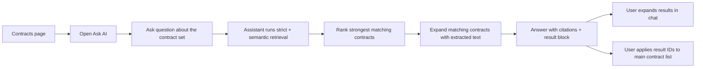
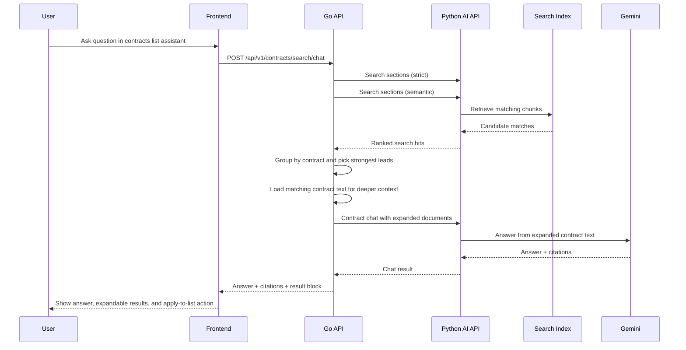
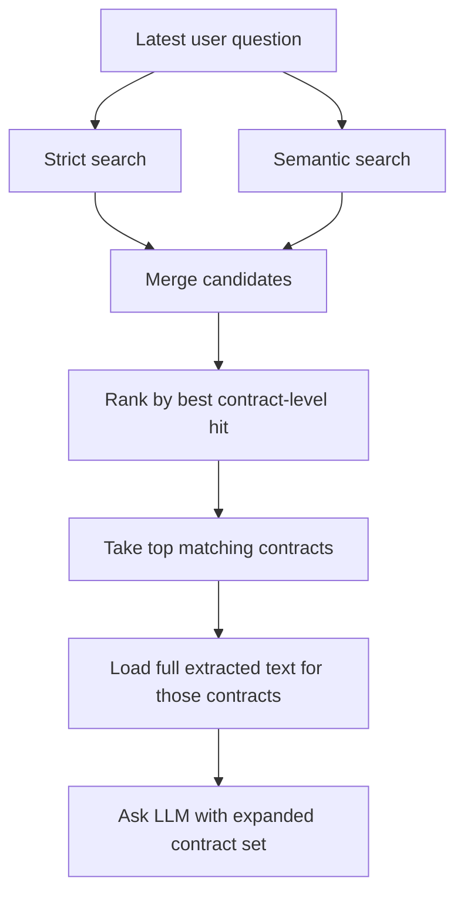
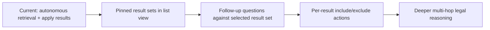

# Contracts RAG Assistant

## User flow

### Current scope
- Ask questions from the contracts list without granting the assistant blanket access to every full contract by default
- Run autonomous retrieval behind the scenes using both strict and semantic search
- Expand the strongest matching contracts before answering so the assistant can dig deeper when needed
- Return a compact result block in chat that can also drive the main contract list filter

## Technical flow

### Main files
- `frontend/src/pages/ContractsPage.tsx`
- `frontend/src/api/client.ts`
- `go-api/internal/http/handlers/contract_chat.go`
- `go-api/internal/http/router/router.go`

## Retrieval strategy

### Why we use a staged RAG flow
- The contracts list can span many contracts, so sending all extracted text into one prompt is too expensive and noisy
- Some questions respond better to exact wording, while others respond better to semantic similarity
- The UI needs actionable results, not only a prose answer

### Current retrieval plan

### Result block behavior
- The assistant answer can include a result block with matched contract/document IDs, names, scores, and snippets
- Users can expand that block inside chat to inspect matches
- Users can apply those IDs back into the contracts page to filter the main list view

## Current limitations
- The assistant still decides retrieval server-side rather than exposing tool-by-tool execution in the UI
- Contract ranking is based on best hit score rather than a richer multi-signal relevance model
- List filtering uses an assistant-owned filter state rather than rewriting the text search box
- Deep follow-up inspection is limited to contracts with extracted text already available

## Next likely step

