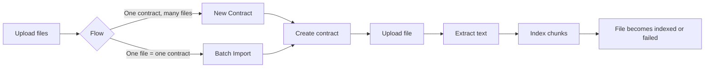
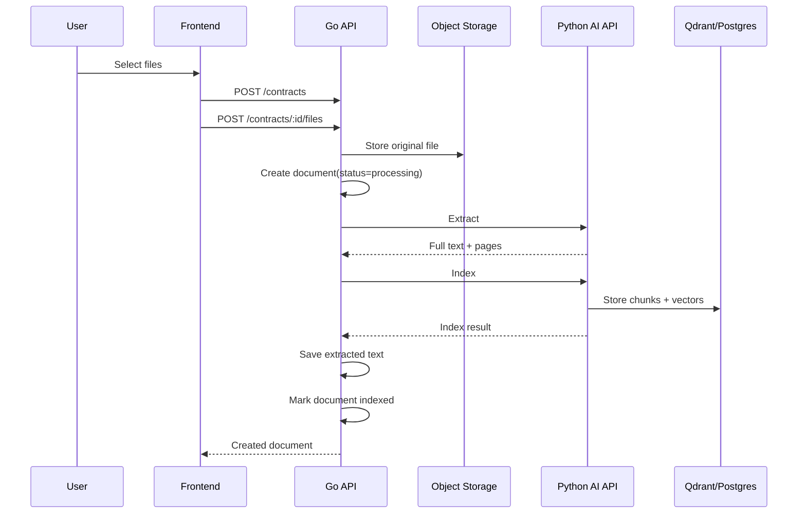
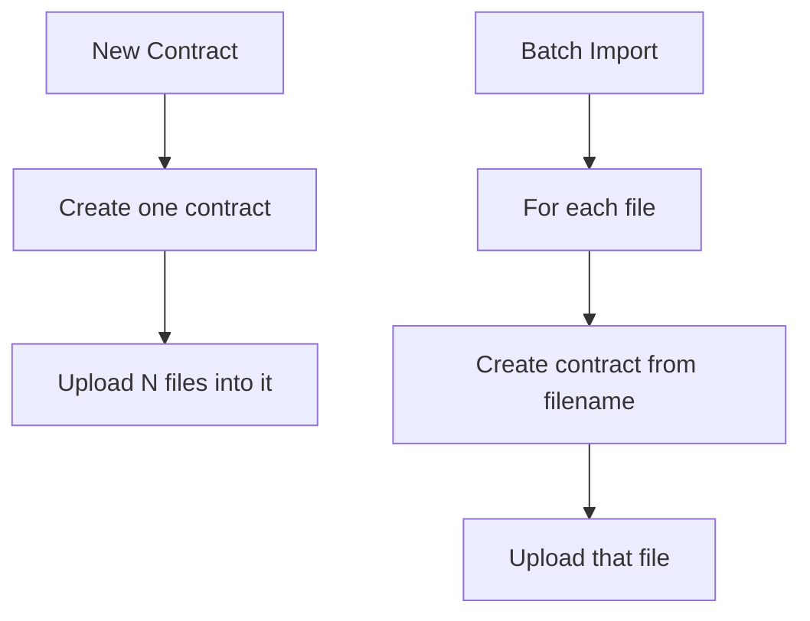
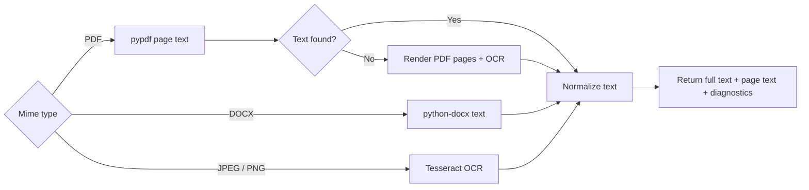
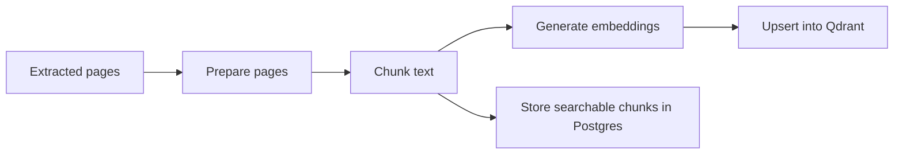
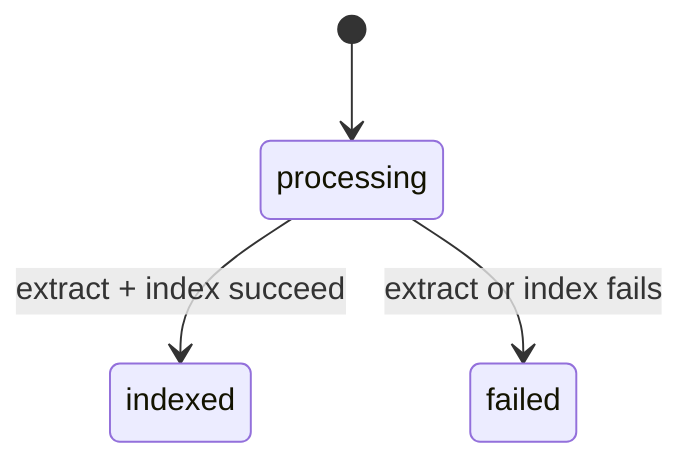
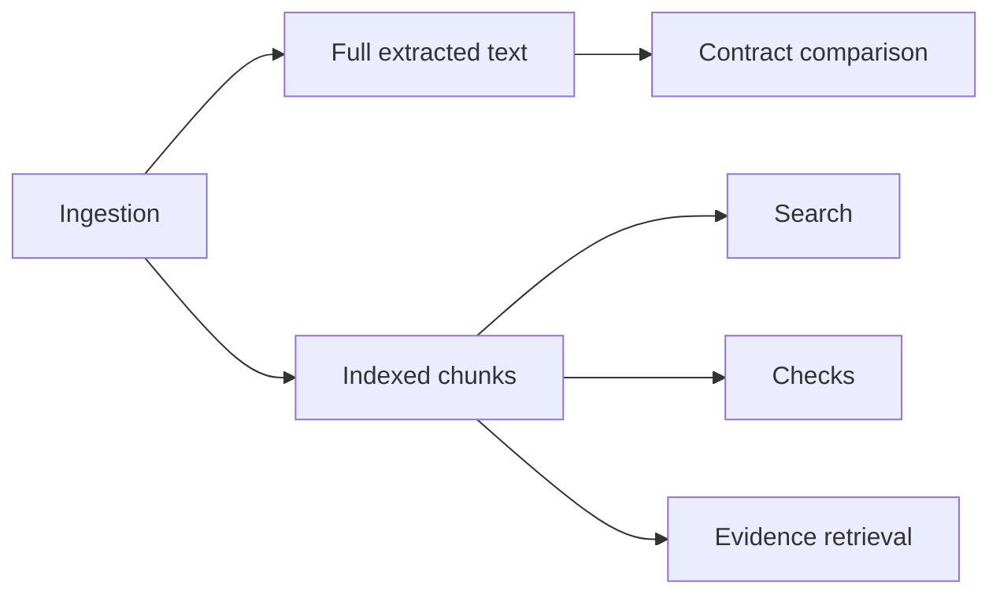

# Document Ingestion

## User flow

### Current entry points
- `New Contract`: many files under one contract
- `Batch Import Contracts`: one contract per file

### Supported files
- PDF
- JPEG
- PNG
- DOCX

## Technical flow

### Main files
- `frontend/src/pages/NewContractPage.tsx`
- `frontend/src/pages/BatchImportContractsPage.tsx`
- `frontend/src/pages/contractUpload.ts`
- `go-api/internal/http/handlers/documents.go`
- `go-api/internal/http/handlers/contracts.go`
- `py-ai-api/py_ai_api/services/extraction.py`
- `py-ai-api/py_ai_api/services/indexing.py`

## Upload variants

## Extraction

### OCR nuance
- PDFs try native text extraction first
- If a PDF is effectively image-only after normalization, each page is rendered and OCR'd before indexing
- See [OCR + Text Extraction](./ocr-text-extraction.md) for the full extraction/runtime details

## Indexing

### Current defaults
- Chunk size: `800`
- Chunk overlap: `120`

## Status model

### Notes
- `ingested` exists in the model
- Current upload flow mainly uses `processing -> indexed|failed`

## Outputs used by other features

## Failure handling
- Validation errors stop the upload
- Extraction/indexing errors mark the file `failed`
- In batch import, one failed file does not stop the rest
- In single-contract upload, the contract may still be created even if some file processing fails
