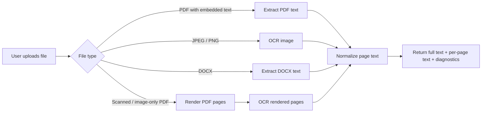
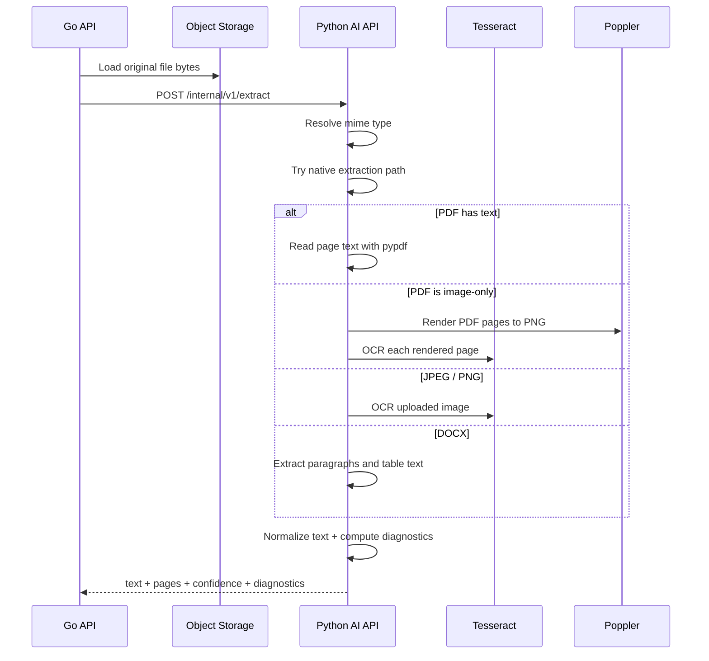
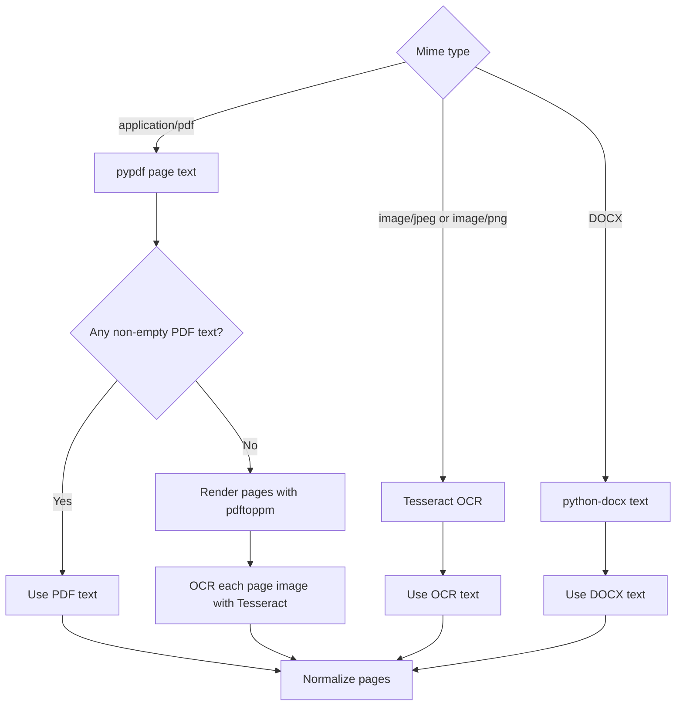
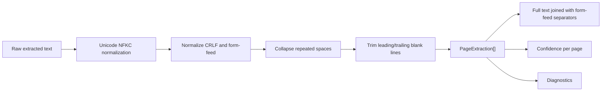
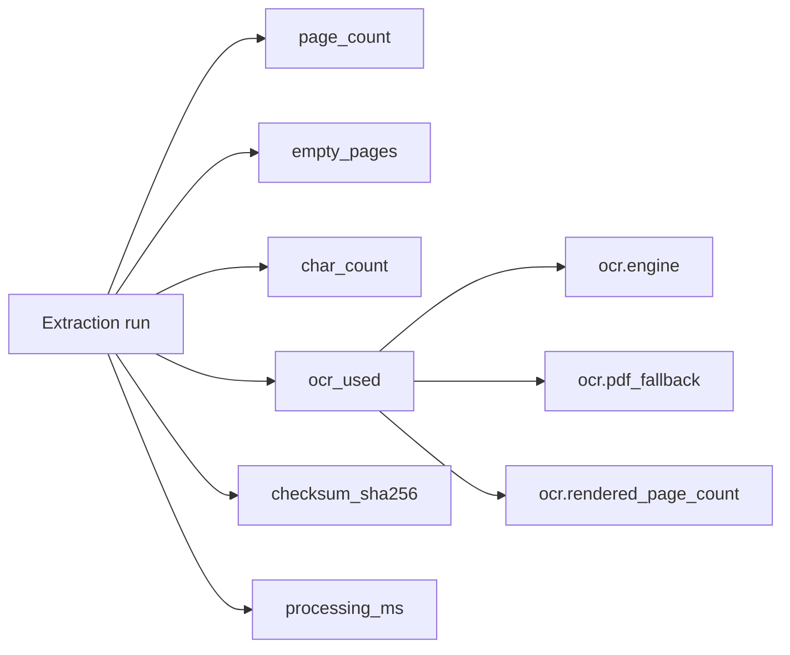
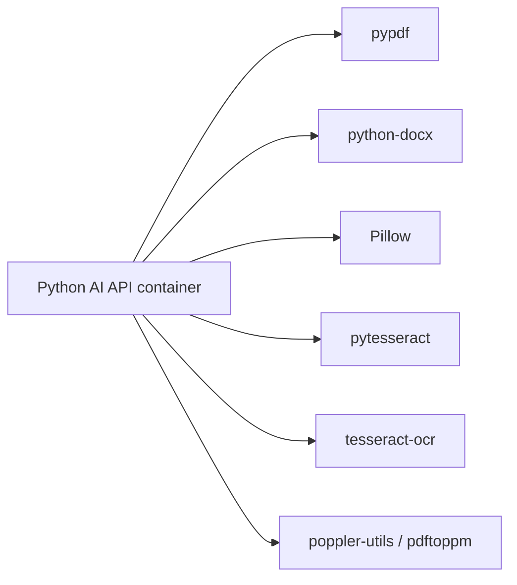
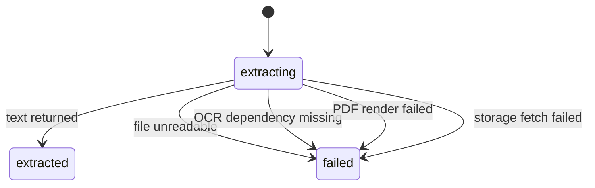
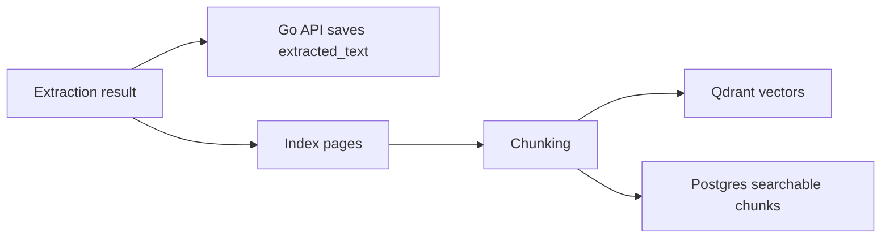

# OCR And Text Extraction

## User flow

### Current scope
- Supports PDF, JPEG, PNG, and DOCX uploads
- Produces normalized full-document text and per-page text
- Returns diagnostics used for indexing and failure analysis

## Technical flow

### Main files
- `py-ai-api/py_ai_api/services/extraction.py`
- `py-ai-api/py_ai_api/models/extraction.py`
- `py-ai-api/py_ai_api/api/routes/internal.py`
- `go-api/internal/ai/client.go`
- `go-api/internal/http/handlers/documents.go`
- `py-ai-api/Dockerfile`

## Extraction strategies

### Strategy details
- PDF text path: uses `pypdf` page extraction first
- Scanned PDF fallback: if every extracted PDF page is empty after normalization, the service renders pages with `pdftoppm` and OCRs those rendered page images
- Image path: OCR runs directly on uploaded JPEG and PNG files
- DOCX path: extracts paragraph text plus table cell text

## Normalization and outputs

### Output shape
- `text`: full normalized document text
- `pages`: one normalized page entry per page
- `confidence`: average confidence across pages
- `diagnostics`: includes page count, empty pages, char count, checksum, processing time, and OCR metadata

## Diagnostics and observability

### Current OCR diagnostics
- `ocr_used`: whether OCR participated in extraction
- `ocr.engine`: currently `tesseract`
- `ocr.pdf_fallback`: present when a PDF had to be treated as image-only
- `ocr.rendered_page_count`: number of rendered PDF pages sent through OCR

## Runtime dependencies

### Required native tools
- `tesseract-ocr` for OCR itself
- `poppler-utils` for scanned PDF page rendering via `pdftoppm`

## Failure modes

### Typical failure cases
- Storage URL cannot be fetched
- Uploaded file is malformed
- `tesseract` or `pdftoppm` is unavailable in the running container
- OCR cannot open the rendered image payload

## Relationship to indexing

- OCR quality directly affects searchable chunks, guideline checks, contract chat, and document text display
- If extraction returns empty text and empty pages, indexing can complete with zero chunks, which leaves search and checks without evidence
